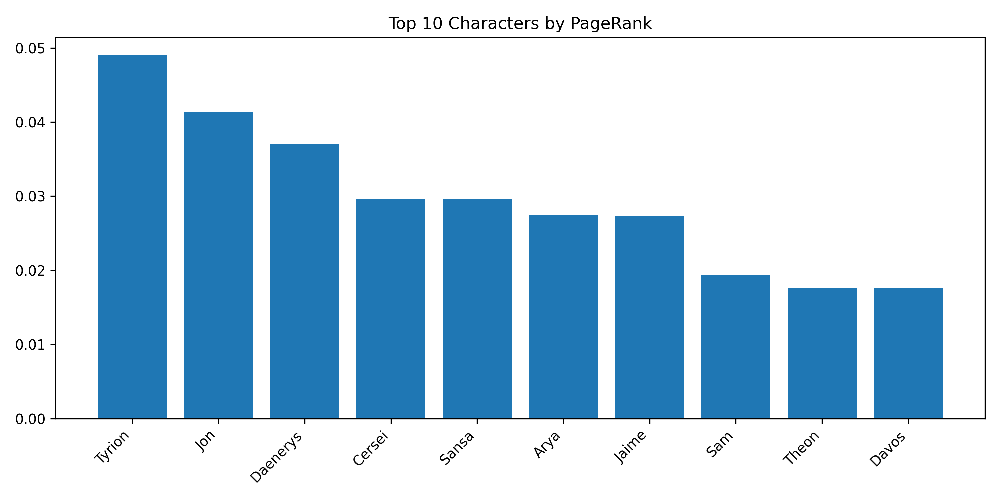
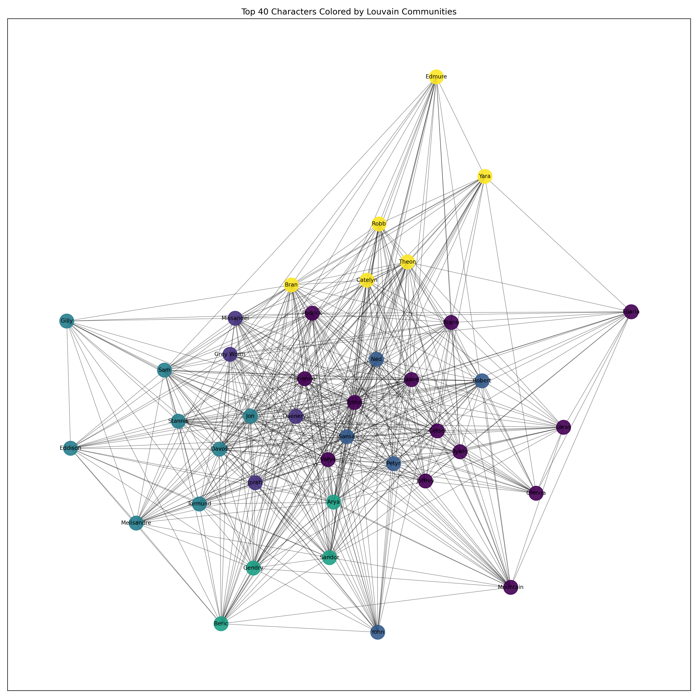

# Game of Thrones Character Network Analysis

Which characters are most connected, which act as bridges, and how does the network divide into communities?

This academic project, developed for **HY-484**, explores those questions using character-interaction data from all eight seasons of HBO's *Game of Thrones*. It combines the season datasets into a weighted, undirected graph and compares degree, strength, weighted betweenness centrality, and PageRank, followed by Louvain community detection.

**Tools:** Python · pandas · NetworkX · Matplotlib · python-louvain

> **Spoilers:** Character names and the analysis cover the complete series.

## Results at a glance

The combined graph contains **406 unique characters**, **2,637 edges**, and **2 connected components**, with a density of approximately **0.0321**.

The table below summarizes selected characters from the [committed comparison table](ReportPics/CompareMetrics_TopNodes.csv). Scores are rounded for readability.

| Character | Degree | Strength | Weighted betweenness | PageRank |
|---|---:|---:|---:|---:|
| Tyrion | 128 | 5,875 | 0.432288 | 0.048974 |
| Jon | 105 | 4,753 | 0.411802 | 0.041324 |
| Daenerys | 93 | 3,839 | 0.208263 | 0.036969 |
| Cersei | 86 | 3,727 | 0.141499 | 0.029635 |
| Sansa | 101 | 3,607 | 0.347537 | 0.029571 |

Three observations from the saved results:

- **Tyrion leads all four measures.** He combines a large number of distinct connections with high interaction volume and a strong position on weighted shortest paths.
- **Sansa's position depends on the measure.** She ranks third by degree and weighted betweenness, but fifth by PageRank. Connectivity, bridging, and weighted network prominence describe different aspects of her role.
- **Community detection adds a local perspective.** The saved Louvain results identify eight communities. Examples of their highest-PageRank members include Tyrion/Cersei/Jaime and Jon/Sam/Davos. These are algorithmic groups; interpreting them as storylines requires context.

These observations describe the interaction network, rather than a definitive ranking of narrative importance.

### Character rankings



### Community structure

The following view shows the **40 highest-degree characters**, colored using communities detected on the **full graph**.



## Data and graph construction

The source dataset is [Andrew Beveridge's Game of Thrones interaction network](https://github.com/mathbeveridge/gameofthrones). Its interactions include adjacent speech, mentions, shared stage directions, and scene co-appearance.

- **Nodes:** Characters identified by `Id`, with display names from `Label`.
- **Edges:** Undirected character pairs.
- **Weights:** Interaction counts summed across seasons.

`merge_nodes.py` combines the seasonal node files and removes duplicate `(Id, Label)` pairs. The graph itself is keyed by `Id`: multiple labels for the same ID represent one graph node, with the last loaded label retained.

`merge_edges.py` sorts the endpoints of each pair so that `(A, B)` and `(B, A)` are treated as the same edge, then sums their weights.

## Methods

| Method | What it measures | Implementation |
|---|---|---|
| Degree | Number of distinct neighbors | Unweighted degree |
| Strength | Total interaction weight | Sum of incident edge weights |
| Betweenness centrality | Position on shortest paths between characters | Normalized, using `distance = 1 / weight` |
| PageRank | Weighted random-walk prominence | Interaction weights; default damping factor `0.85` |
| Louvain | Groups with relatively dense internal connections | Weighted modularity optimization; `random_state=42` |

For betweenness, a stronger interaction is assigned a shorter distance. This is a modeling assumption that makes frequently interacting characters closer in the shortest-path calculation. PageRank and Louvain use the original interaction weights.

The spring-layout visualizations use `seed=42`. Community labels are arbitrary, and results or layouts may vary with dependency versions.

## Run locally

Use **Python 3.12** and run the commands from the repository root. The pipeline was verified on Windows with **Python 3.12.14** and the package versions pinned in `requirements.txt`. Git is needed only for the clone command; alternatively, download and extract the repository ZIP.

### 1. Get the project

```sh
git clone https://github.com/Aristos16/Graph-Analysis-in-GOT.git
cd Graph-Analysis-in-GOT
python -m venv .venv
```

On Windows, activate the environment using Command Prompt:

```bat
.venv\Scripts\activate.bat
```

On macOS or Linux:

```sh
source .venv/bin/activate
```

On systems where the command is `python3`, use it instead of `python` when creating the environment.

### 2. Install dependencies

```sh
python -m pip install -r requirements.txt
```

SciPy is included because NetworkX uses it for PageRank. The package `python-louvain` supplies the `community` import used by the analysis.

### 3. Rebuild the data and generate results

```sh
python -c "from pathlib import Path; Path('ReportPics').mkdir(exist_ok=True)"
python merge_nodes.py
python merge_edges.py
python LoadGraph.py
```

This rebuilds the combined CSVs in `data/` and writes eight PNG charts and four result tables to `ReportPics/`, replacing existing files with the same names. Network statistics, rankings, and community sizes are printed to the terminal.

The output directory already exists in the repository, but the first command also handles a copy where it has been removed. The current scripts use paths relative to the working directory, so running them from another folder will fail.

## Repository structure

```text
Graph-Analysis-in-GOT/
├── README.md
├── requirements.txt
├── LoadGraph.py
├── merge_nodes.py
├── merge_edges.py
├── data/          # Season datasets and combined node/edge CSVs
├── ReportPics/    # Generated charts and result tables
└── docs/          # Original course report and presentation
```

Main result tables:

- [Top ten by weighted betweenness](ReportPics/Top10_betweenness_weighted.csv)
- [Top ten by weighted PageRank](ReportPics/Top10_pagerank_weighted.csv)
- [Metric comparison](ReportPics/CompareMetrics_TopNodes.csv) — the union of the betweenness and PageRank top-ten lists
- [Community leaders](ReportPics/CommunityLeaders_Top10Communities.csv) — up to three members per community, ranked by full-graph PageRank, for the ten largest communities (or all communities if fewer than ten)

Course materials:

- [Original report (PDF)](docs/ReportPhaseB_csd4952.pdf)
- [Original presentation (PowerPoint)](docs/PresantationB_Csd4952.pptx)

## Limitations and possible extensions

- Aggregating eight seasons hides changes over time and gives longer-running characters more opportunities to accumulate interactions.
- The source combines several interaction types. An edge does not necessarily mean friendship, direct dialogue, or a causal relationship.
- The inverse-weight distance is one choice; alternative transformations can change betweenness rankings.
- Louvain provides one partition at a particular resolution. This project does not evaluate partition stability across seeds or resolutions.
- The top-40 visualization omits most characters and connections. It is a readable view of a subgraph, not the full network.
- The project applies established library algorithms. It does not train a predictive model or evaluate narrative importance against independent labels.

Useful extensions would include season-by-season comparisons, sensitivity analysis for the distance transformation, and community stability checks.

## Attribution

The interaction dataset is provided by [Andrew Beveridge / Network of Thrones](https://github.com/mathbeveridge/gameofthrones). The source repository identifies its work as licensed under [CC BY-NC-SA 4.0](https://creativecommons.org/licenses/by-nc-sa/4.0/); retain its attribution and follow those terms when reusing the data.

Data preparation, analysis scripts, and the original course report/presentation in this repository were prepared by Aristotelis Moulas for HY-484.
